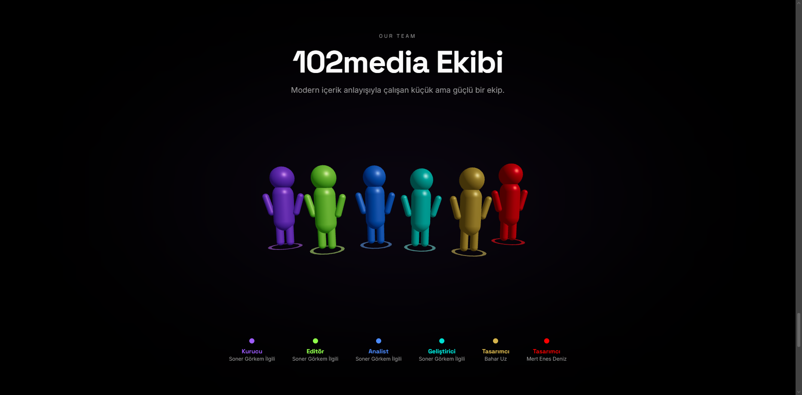
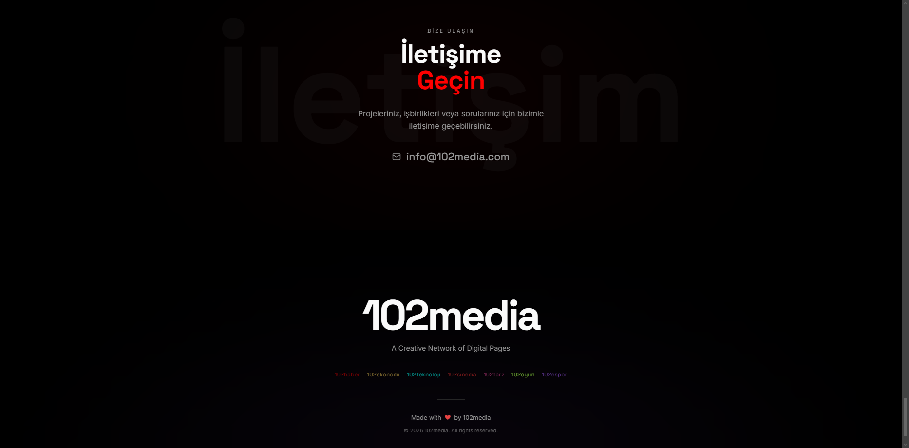

# 102 Media

### *Modern Digital Media Platform with 7 Unique Brands*

[About](#about) • [Features](#features) • [Screenshots](#screenshots) • [Tech Stack](#tech-stack) • [Contact](#contact)

---

## About

A cutting-edge digital media platform that brings together 7 distinct content brands under one beautifully designed interface. This modern platform delivers breaking news, economic insights, technology trends, entertainment content, lifestyle inspiration, gaming updates, and esports coverage with smooth animations and professional aesthetics.

<table>
<tr>
<td width="33%" align="center">

7 unique content brands  
Custom color themes  
Distinct identities  
Unified experience

</td>
<td width="33%" align="center">

Built with React 18  
TypeScript & Vite  
Optimized performance  
Production-ready code

</td>
<td width="33%" align="center">

Smooth animations  
Responsive design  
Professional UI/UX  
Fast load times

</td>
</tr>
</table>

**What makes this special:**  
Every component, animation, and interaction is crafted to deliver a premium media experience. From the loading screen to brand showcases, this platform bridges the gap between content diversity and unified design excellence.

---

## Features

<table>
<tr>
<td width="33%" valign="top">

- Modern minimalist interface
- Smooth scroll animations
- Professional loading screen
- Glassmorphism effects
- Dark mode support
- Custom brand color themes

</td>
<td width="33%" valign="top">

- Lightning-fast load times (< 2s)
- Optimized assets
- Code splitting
- Lazy loading
- SEO optimized
- Smooth page transitions

</td>
<td width="33%" valign="top">

- **102haber** - News & Current Affairs
- **102ekonomi** - Economy & Crypto
- **102teknoloji** - Technology & Startups
- **102sinema** - Cinema & Series
- **102tarz** - Lifestyle & Fashion
- **102oyun** - Gaming
- **102espor** - Esports & Tournaments

</td>
</tr>
<tr>
<td width="33%" valign="top">

- TypeScript type safety
- Component-based architecture
- Modern React patterns
- 50+ reusable components
- Accessible UI components
- Clean, maintainable code

</td>
<td width="33%" valign="top">

- Mobile-first approach
- Tablet optimization
- Desktop experience
- Touch-friendly interface
- Adaptive layouts
- Cross-browser compatible

</td>
<td width="33%" valign="top">

- 14 social media accounts
- Twitter integration
- Instagram integration
- Real-time updates
- Community engagement
- Brand connectivity

</td>
</tr>
</table>

---

## Screenshots

*Homepage with hero section and brand showcase*

  

<table>
<tr>
<td width="50%">

<b>Brand Showcase Sections</b>

</td>
<td width="50%">

<b>Brand Detail Pages</b>

</td>
</tr>
<tr>
<td width="50%">

<b>Team Section</b>

</td>
<td width="50%">

<b>Footer & Contact</b>

</td>
</tr>
</table>

---

## Our Brands

<table>
<tr>
<td width="50%" align="center">

Breaking news and current affairs coverage

</td>
<td width="50%" align="center">

Finance, economy, and cryptocurrency insights

</td>
</tr>
<tr>
<td width="50%" align="center">

Tech trends, startups, and innovation

</td>
<td width="50%" align="center">

Movies, TV series, and entertainment

</td>
</tr>
<tr>
<td width="50%" align="center">

Lifestyle, fashion, and trends

</td>
<td width="50%" align="center">

Gaming news and community

</td>
</tr>
<tr>
<td colspan="2" align="center">

Esports tournaments and professional gaming

</td>
</tr>
</table>

---

## Tech Stack

| Technology | Purpose |
|------------|---------|
|  | UI component library |
|  | Type-safe development |
|  | Build tool and dev server |
|  | Utility-first styling |
|  | Animation library |
|  | UI component library |
|  | Accessible components |
|  | Client-side routing |
|  | State management |
|  | Icon library |
|  | 3D graphics |

---

## Performance

<table>
<tr>
<td width="33%" align="center">

Page Load: **< 2s**  
First Paint: **< 1s**  
Interactive: **< 2s**  
Optimized assets

</td>
<td width="33%" align="center">

Code splitting & lazy loading  
Image optimization  
Bundle size optimized  
Smooth 60fps animations

</td>
<td width="33%" align="center">

All modern browsers  
Mobile responsive  
Touch-friendly  
Cross-platform

</td>
</tr>
</table>

---

## Project Highlights

<table>
<tr>
<td width="50%" align="center">

**7** Content Brands  
**14** Social Media Accounts  
**50+** UI Components  
**100%** Responsive Design

</td>
<td width="50%" align="center">

✅ Multi-brand platform  
✅ Smooth animations  
✅ Type-safe codebase  
✅ SEO optimized

</td>
</tr>
</table>

---

## Contact

 

 

---

## License

This project is created for 102 Media. All rights reserved.

---

**Made with ❤️ by Görkem**

*Bringing modern media experience to the web*

 

> **Note:** This is a production website for 102 Media platform.

